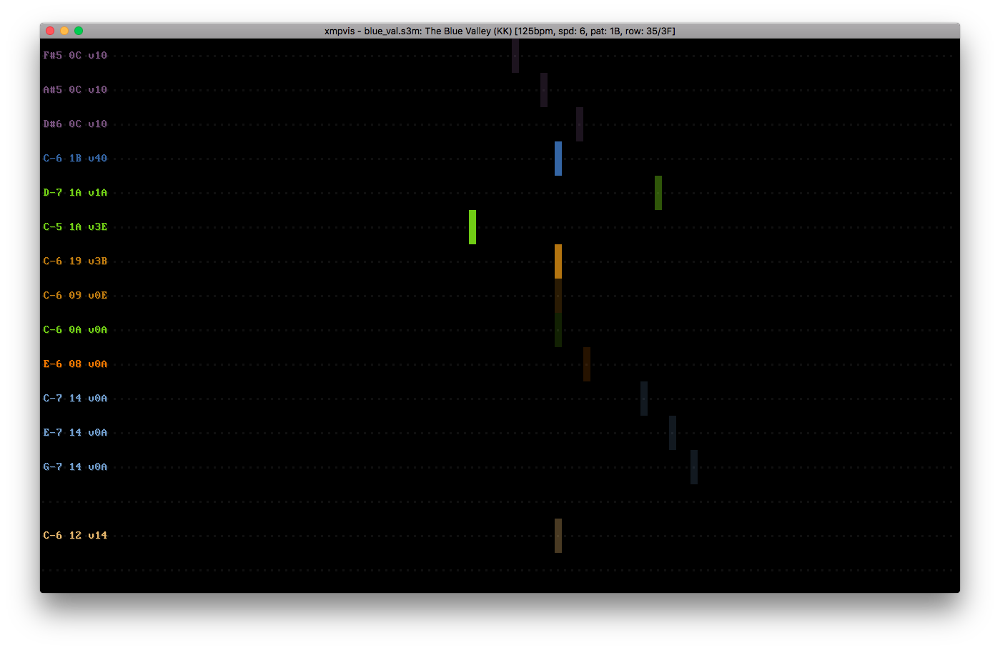

# xmpvis

A visualiser for tracker music played back through libxmp.



## Requirements

* a D2 compiler (I tested with dmd 2.078 and ldc 1.3.0)
* DUB
* sdl2, sdl2_ttf
* libxmp > 4.4

On macOS you can install these dependencies using homebrew:

``` sh
brew install dmd dub sdl2 sdl2_ttf libxmp
```

## Building

Building is easy:

``` sh
dub build
```

This should generate a `./xmpvis` executable in the repo root.  Pass the module
file you want to play as argument and enjoy the show.

## Bugs

Yes.

## Licence

BSD-2-Clause
